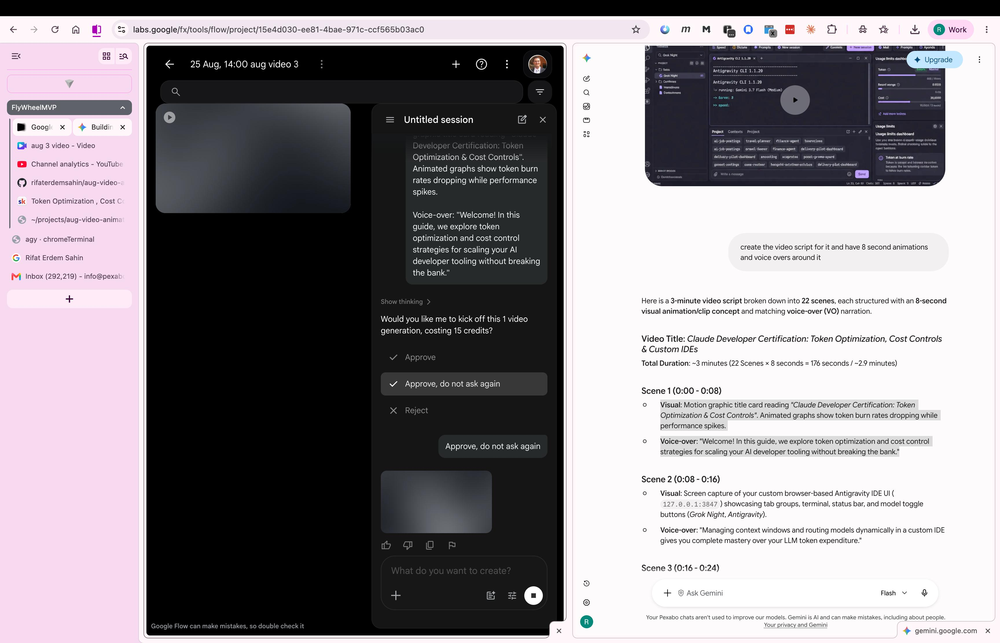

# 🎬 Production Stage Simulation: Gemini + Google Flow Split-View

## 📌 Architecture of this Production Stage

This stage represents the **Live Generation Bridge** between **Stage 2 (Gemini Scripting)** and **Stage 3 (Google Flow Video Generation)**:

### 1. Right Pane: Gemini Prompt & Script Engine (`gemini.google.com`)
- **Input**: The creator feeds research context (Skool video, IDE screenshot of Antigravity at `127.0.0.1:3847`, usage limit gauges).
- **Prompt Execution**: Gemini formats the content into a strictly timed **22-scene × 8-second structure** (176s total).
- **Output Stream**: Delivers matched pairs of:
  1. *Visual 8s motion concept & technical description*
  2. *Voice-Over (VO) script tailored for 8-second spoken delivery (~18-22 words)*

### 2. Left Pane: Google Flow Generative Video Engine (`labs.google/flow`)
- **Project**: `25 Aug, 14:00 aug video 3` under workspace `FlyWheelMVP`.
- **Workflow Action**: The creator copies each scene's visual prompt directly into Google Flow's prompt bar.
- **Credit Accounting**: Each 8-second video generation costs **15 credits**.
- **Credit Approval**: User activates *"Approve, do not ask again"* to stream prompt batches without interrupting flow.
- **Parallel Render Queue**: Generates sequential 8s MP4 video slices ready for download and Canva import.

---

## 🧪 Production Sanity Check & Analysis

| Aspect | Analysis & Opportunity | Risk / Failure Mode | Recommended Mitigation |
| :--- | :--- | :--- | :--- |
| 🪙 **Credit Consumption** | 22 scenes × 15 credits = **330 credits base**. | Regens due to visual artifacts push cost to 450+ credits. | Use locked style seeds & test single representative prompt first. |
| 🎨 **Visual Continuity** | Fast rendering of cinematic 3D motion graphics. | Inconsistent art styles across different scenes (e.g. 2D flat vs 3D CGI). | Prefix every Flow prompt with a standard **Style Anchor** string. |
| 🔤 **Text & Code Accuracy** | AI video models excel at abstract motion & lighting. | Generative video hallucinations on fine text (`127.0.0.1:3847`, CLI syntax). | **Golden Rule**: Use real screen captures for code/UI; use Flow for motion & metaphors. |
| ⏱️ **Audio-Video Drift** | 8.0s clip lengths match 8.0s VO narration chunks. | Voice narration running >8.5s or <6.5s causes timeline desync in Canva. | Rehearse with the **8s Teleprompter Studio** before locking video cuts. |
| 🎭 **Roger Rabbit Identity** | Human authentic voice + real UI + cartoon overlays. | Pure AI video looks generic and impersonal. | Composite real terminal footage with animated badges in Canva Post-Prod. |
