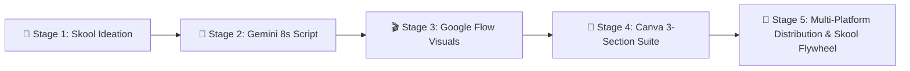

# 🎬 3-Minute AI Animation Video Production Helper

> **Project Title**: *Claude Developer Certification: Token Optimization, Cost Controls & Custom IDEs*  
> **Production Format**: 22 Scenes × 8 Seconds = 176 Seconds (~2.93 Minutes)  
> **Live App**: [https://rifaterdemsahin.github.io/aug-video-animation-3/](https://rifaterdemsahin.github.io/aug-video-animation-3/)

---

## 🚀 The 5-Stage Production Workflow

### 🏫 Stage 1: Skool Ideation & Research
- **Source Classroom Video**: [Delivery Pilot Skool Classroom](https://www.skool.com/delivery-pilot-8938/classroom/2193c55b?md=d5f6b19d348d4f28a062641d2fc3e4df)
- **Signature Style**: Roger Rabbit style (cartoon overlay + real code/terminal UI at `127.0.0.1:3847`)
- **Voice Identity**: Authentic voice recording with precise 8-second pacing.

### 🤖 Stage 2: Gemini Script & 8s Prompts
- **Gemini Session**: [Gemini AI Prompt Engine](https://gemini.google.com/app/5778f4a7d4e60f03)
- **The 8-Second Formula**: 22 distinct scenes, each containing:
  - 8-second visual motion graphic concept
  - AI video generation prompt (Google Flow / Veo)
  - 18–24 word voice-over (VO) narration timed to 8 seconds.

### 🎬 Stage 3: Google Flow Visual Generation
- **Tool**: [Google Flow](https://labs.google/flow)
- **Specs**: 16:9 Landscape / 9:16 Vertical, 60fps cinematic 3D isometric & holographic UI prompts.

### 🎨 Stage 4: Canva 3-Section Production
1. 📝 **Pre-prod**: Script in digital Post-it notes per 8-second timestamp.
2. 🎥 **Prod**: Uploading and aligning Google Flow generated 8s video footages.
3. 🎙️ **Post-prod**: VO recording in own voice, Roger Rabbit animated signature stamp, audio leveling, and master export.

### 🚀 Stage 5: Multi-Platform Distribution & The Skool Flywheel
- **Free Social Distribution**:
  - 🏫 **Skool**: Classroom post + raw asset package
  - 🔴 **YouTube**: 3-minute video with 22 timestamp chapters
  - 💼 **LinkedIn**: 5-pillar technical breakdown
  - 🐦 **X (Twitter)**: Rapid-fire 5-tweet thread
- **The Skool Value Proposition**:
  - 📦 **Packaging**: Curated prompt packs & IDE configuration templates
  - 👥 **Community**: Peer accountability and architecture discussions
  - 🤝 **Self-Commitment**: Daily build challenges and progress logs
  - 🎯 **1-on-1 Sessions**: High-touch architecture audits and pair programming

---

## 🛠️ Helper Web App Features

- 🎯 **Stage-by-Stage Navigation**: Sticky top header for fast switching across all 5 stages.
- 🎙️ **8-Second VO Teleprompter Studio**: Interactive rehearsal loop with 8-second countdown timer, metronome audio cues, and Web Speech TTS voice preview.
- 📋 **Master 22-Scene Matrix**: Search, filter by production phase, and toggle completion with persistent `localStorage`.
- 📥 **One-Click Generators**: Instant export for YouTube Chapters, LinkedIn posts, X threads, and `.SRT` subtitle captions.
- 🎨 **Canva 3-Section Board Simulator**: Digital post-it notes and footage sync timeline.

---

## 🌐 Live Access

- **GitHub Pages**: [https://rifaterdemsahin.github.io/aug-video-animation-3/](https://rifaterdemsahin.github.io/aug-video-animation-3/)
