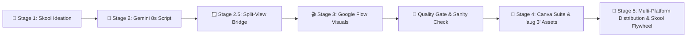

# 🌐 Live Helper Web App: [https://rifaterdemsahin.github.io/aug-video-animation-3/](https://rifaterdemsahin.github.io/aug-video-animation-3/)
# 🛠️ Tools & Tabs Ecosystem: [https://rifaterdemsahin.github.io/aug-video-animation-3/tools.html](https://rifaterdemsahin.github.io/aug-video-animation-3/tools.html)

---

# 🎬 3-Minute AI Animation Video Production Helper

> **Project Title**: *Claude Developer Certification: Token Optimization, Cost Controls & Custom IDEs*  
> **Production Format**: 22 Scenes × 8 Seconds = 176 Seconds (~2.93 Minutes)  
> **Total Production Turnaround**: ~2 hours 15 minutes (135 Minutes)  
> **Direct Live Link**: 👉 [https://rifaterdemsahin.github.io/aug-video-animation-3/](https://rifaterdemsahin.github.io/aug-video-animation-3/) 👈  

---

## 🧭 Multi-Page Architecture & Distinct Workspaces

The application is structured into **7 dedicated, logically grouped pages** with a shared top navigation header:

| Group | Emoji & Page | File | Purpose & Operational Flow |
| :--- | :--- | :--- | :--- |
| **🎬 Overview** | 🎯 **Pipeline Intro & Status** | [`index.html`](index.html) | Primary production hub: stage roadmap, duration breakdown (~2.25h), real-time progress monitor, and workspace directory. |
| **🎬 Overview** | ⚡ **Stages Deep-Dive** | [`pipeline.html`](pipeline.html) | Step-by-step guides for Stages 1 to 5, split-view simulations, Canva 3-Section workspace, and Azure-synced checklists. |
| **🎨 Production** | 📋 **22-Scene Storyboard** | [`storyboard.html`](storyboard.html) | Master 22-scene matrix (8s slices), Google Flow prompts, VO scripts, word count checker, and tri-state status toggles. |
| **🎨 Production** | 🎙️ **8s VO Studio** | [`studio.html`](studio.html) | Dedicated voice recording booth with 8-second countdown timer, metronome audio cues, and speech synthesis reference. |
| **🛠️ Tools & QC** | 🌐 **Chrome Cockpit** | [`tools.html`](tools.html) | 14-Tab Chrome cockpit map, 8 core software platforms, and tool-to-stage integration matrix. |
| **🛠️ Tools & QC** | 🧪 **QC & Budget Gate** | [`qc-budget.html`](qc-budget.html) | Interactive 15-credit calculator, 6 critical failure points mitigation matrix, and pre-flight quality verification. |
| **🚀 Distribution** | 📤 **Social & Flywheel** | [`distribution.html`](distribution.html) | 5-step Skool Community Value Flywheel, one-click social post generators (YouTube, LinkedIn, X), and SRT export. |

---

## 🚀 The 5-Stage Production Workflow

### 🏫 Stage 1: Skool Ideation & Research (Pre-Prod Setup)
- **🌐 Chrome Tabs Production Cockpit**: 14 orchestrated tabs managing the entire workflow (see [`tools.html`](https://rifaterdemsahin.github.io/aug-video-animation-3/tools.html)):
  1. 📹 `aug 3 video - Video` — *Canva / Video Editor (Primary Timeline & Sliding Post-it)*
  2. 🌐 `~/projects/aug-video-animation-3 · chromeTerminal` — *Chrome Terminal / Local Dev / Web App*
  3. 🎥 `Google Flow - 25 Aug, 1` — *Google Flow (Google Workspace / Cloud Service)*
  4. ✦ `Building a Token-Managing IDE - Google Gemini` — *Google Gemini Director*
  5. ✦ `Building a Token-Managing IDE - Google Gemini` — *Google Gemini Iteration*
  6. 📹 `aug 3 video - Video` — *Canva / Asset Staging & Layer Management*
  7. 🎥 `Google Flow - 25 Aug, 1` — *Google Flow Batch Render Queue*
  8. ▶️ `Community - YouTube Studio` — *YouTube Studio Distribution*
  9. 🐙 `aug-video-animation-3/3_Simulation/prod_stage_read_a` — *GitHub Simulation Capture*
  10. 🐙 `rifaterdemsahin/roger-rabbit: Animation in real world` — *GitHub Roger Rabbit Spec*
  11. 🎴 `🌱 Become the person who does what they say they will` — *Skool Community Hub*
  12. 🌐 `3-Minute AI Animation Video Production Suite 🎬 | Helpe` — *Live Web App (GitHub Pages)*
  13. 🌐 `agy · chromeTerminal` — *Antigravity CLI IDE / Agent Terminal*
  14. 🌐 `3-Minute AI Animation Video Production Suite 🎬 | Helpe` — *Local Dev Test Suite*
- **Source Classroom Video**: [Delivery Pilot Skool Classroom](https://www.skool.com/delivery-pilot-8938/classroom/2193c55b?md=d5f6b19d348d4f28a062641d2fc3e4df)
- **Signature Style**: Roger Rabbit style (cartoon overlay + real code/terminal UI at `127.0.0.1:3847`)
- **Voice Identity**: Authentic voice recording with precise 8-second pacing.

### 🤖 Stage 2: Gemini Script & 8s Prompts
- **Gemini Session**: [Gemini AI Prompt Engine](https://gemini.google.com/app/5778f4a7d4e60f03)
- **The 8-Second Formula**: 22 distinct scenes, each containing:
  - 8-second visual motion graphic concept
  - AI video generation prompt (Google Flow / Veo)
  - 18–24 word voice-over (VO) narration timed to 8 seconds.

### 🪟 Stage 2.5: Split-View Generation Bridge (`3_Simulation/`)
- **Live Pair Interface**: Operating [Google Flow](https://labs.google/flow) on the left side-by-side with [Gemini](https://gemini.google.com) on the right.
- **Credit Accounting**: 15 credits per 8s generation (330 base credits for 22 scenes).
- **Batch Streaming**: Enabling *"Approve, do not ask again"* for frictionless prompt copying.

### 🧪 Sanity Check & Production Quality Gate
- ⚠️ **Main Production Issue & Gate (Sorting Footages & Timeline Gap Check)**: The biggest point of failure in production is unsorted footages or undetected gaps between clips before post-production starts. Always sort footages from `aug video 3` to `used asset` and scrub the timeline with the **shotlist in hand** to guarantee zero missing scenes, black frames, or desyncs before VO recording.
- 🪙 **Budget Estimator**: 22 scenes × 15 credits = **330 base credits** (~420 credits with 25% retakes).
- 🔤 **Text Hallucination Rule**: Never ask generative video models to render exact code or IPs (`127.0.0.1:3847`). Use real screen captures in Canva overlays, and reserve Google Flow for abstract 3D motion metaphors.
- 🎨 **Style Continuity**: Use consistent style anchor keywords (*isometric 3D, cyber-blue/emerald palette, 60fps*).
- ⏱️ **Audio Drift Protection**: Strict 18–22 word limit per 8-second scene.

### 🎨 Stage 4: Canva 3-Section Suite & 'aug 3' Asset Organization
1. **📁 Folder Setup**: Create project folder `aug 3` (or `aug video 3`) in Canva and local drive.
2. **📥 Flow Uploads**: Upload all 22 Google Flow generated 8s MP4 video slices into `aug video 3`.
3. **🗃️ Subfolder `used asset`**: Create `aug video 3/used asset` to archive clips as they are dropped into the Canva timeline.
4. **⚡ 8-Second Master Placeholder & Bulk Paste**: Create **1 master 8-second placeholder container** in Canva (locked to exactly 8.0s with Post-it script framing) and **bulk-paste / duplicate** it across all 22 scene slots on the timeline to eliminate repetitive layout work.
5. **🪟 Prod (Dual-Window Flow + Canva Placement)**: Open Google Flow (`labs.google/flow`) and Canva Prod Section at the same time in split-view to place footage directly onto 8s timeline tracks before importing to Post-Prod.
6. **📝 Pre-prod (Post-it Timeline Guides)**: Add 22 color-coded digital Post-it notes containing scripts directly above Canva timeline tracks to guide Post-Prod sync.
7. **🎬 Prod (Storyboard Video Upload)**: Use Storyboard-like sequence grid in Canva to upload and align 8-second video slices scene-by-scene.
8. **📦 Prod (Move Footages One by One)**: Move footages one by one from `aug video 3` to `used asset` as each clip is placed on the Canva track.
9. **⚠️ Prod (Main Production Gate — Sort Footages & Shotlist-in-Hand Gap Check)**: With the **master 22-scene shotlist in hand**, scrub the timeline using the sliding Post-it note overlay in Canva to verify every footage slice is sorted, correctly sequenced, and has zero missing clips or blank gaps before Post-Prod begins (see [`3_Simulation/prod_stage_read_and_check_for_footage_gaps.jpeg`](https://github.com/rifaterdemsahin/aug-video-animation-3/blob/main/3_Simulation/prod_stage_read_and_check_for_footage_gaps.jpeg)).
10. **🚀 Prod-to-Post Transition Gate**: Move from Production to Post-Production immediately after creating and verifying the 22 8-second placeholder slots on the timeline.
11. **🖼️ Post-Prod (Video as Background Optimization)**: In post placement for each placeholder slot, right-click and choose **"Set Video as Background"** — this automatically snaps the 8s Google Flow footage to full frame, maintaining perfect aspect ratio and minimizing manual resizing/positioning overhead.
12. **🐰 Prod/Post-Prod (Roger Rabbit Format)**: Apply [Roger Rabbit Signature Format](https://github.com/rifaterdemsahin/roger-rabbit/tree/main) — composite real terminal/IDE screen captures with animated cartoon characters and *La Linea* minimalist continuous line overlays via Google Flow.
13. **👀 Prod Review (Playback & Script Verification Gate)**: Watch complete Canva Prod timeline playback (176s) and cross-check against Post-it scripts to verify visual-to-narration sync before moving to Post-Prod.
14. **🎙️ Post-prod (VO & Sync)**: Follow timeline Post-it notes to record master voice-over in own authentic voice.
15. **🎬 Post-prod (Roger Rabbit Stamp)**: Sync cartoon motion to VO audio beats, apply Roger Rabbit animated signature stamp, color-balance layers, and export 1080p 60fps master video (176s).
16. ☁️ **Azure Files Cloud State Synchronization & Tri-State Engine**:
    - **Storage Account**: `animationasistant`
    - **Azure File Share**: `aug-video-state`
    - **State Payload**: `aug_video_animation_state.json`
    - **Key Vault**: `dp-kv-deliverypilot` (Secret: `aug-video-animation-sas`)
    - **Tri-State Status Engine**: Supports `⚪ Todo`, `🟡 In Progress`, and `🟢 Done` states across all checklist stages and storyboard scenes.

### 🚀 Stage 5: Multi-Platform Distribution & The Skool Flywheel
- **Free Social Distribution**:
  - 🏫 **Skool**: Classroom post + raw asset package
  - 🔴 **YouTube**: 3-minute video with 22 timestamp chapters
  - 💼 **LinkedIn**: 5-pillar technical breakdown
  - 🐦 **X (Twitter)**: Rapid-fire 5-tweet thread
- **The Skool Value Proposition**:
  - 📦 **Packaging**: Curated prompt packs & IDE configuration templates
  - 👥 **Community**: Peer accountability and architecture discussions
  - 🤝 **Self-Commitment**: Daily build challenges and progress logs
  - 🎯 **1-on-1 Sessions**: High-touch architecture audits and pair programming

---

## 🛠️ Helper Web App Features

- 🎯 **Stage-by-Stage Navigation**: Sticky top header for fast switching across all stages.
- ☁️ **Azure Files Live Sync**: Two-way synchronization of scene completion and multi-stage checklist state via REST API and CLI.
- 📁 **'aug 3' Asset Pipeline**: Structured tracking for Google Flow uploads and `used asset` subfolder archiving.
- 🪟 **Split-View Simulation Inspector**: Visual breakdown of Gemini + Flow side-by-side workflow.
- 🧪 **Interactive Sanity Check & Credit Calculator**: Dynamic budget estimations and pre-flight validation.
- 🎙️ **8-Second VO Teleprompter Studio**: Interactive rehearsal loop with 8-second countdown timer, metronome audio cues, and Web Speech TTS voice preview.
- 📋 **Master 22-Scene Matrix**: Search, filter by production phase, and toggle completion with persistent `localStorage`.
- 📥 **One-Click Generators**: Instant export for YouTube Chapters, LinkedIn posts, X threads, and `.SRT` subtitle captions.

---

## 🌐 Live Access & Links

- 🌐 **Live Web Application (GitHub Pages)**: [https://rifaterdemsahin.github.io/aug-video-animation-3/](https://rifaterdemsahin.github.io/aug-video-animation-3/)
- 🐙 **GitHub Repository**: [https://github.com/rifaterdemsahin/aug-video-animation-3](https://github.com/rifaterdemsahin/aug-video-animation-3)
- ☁️ **Azure Portal**: [https://portal.azure.com](https://portal.azure.com)
